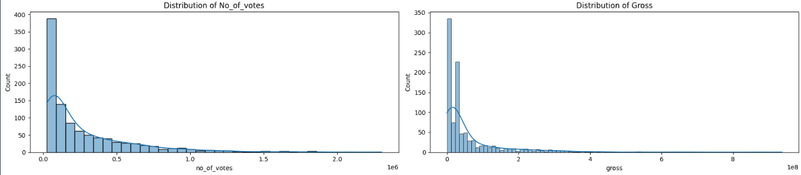

# [Movies IMDB Score Prediction](https://moviepredapp.azurewebsites.net/)


## Dataset
The dataset for this project was given by Incidium, and is about movies with their ratings in IMDB.
It consists of 999 rows with 15 columns:

- **Series_Title**: Name of the movie
- **Released_Year**: Year of release
- **Certificate**: Certificate earned by that movie regarding age rating
- **Runtime**: Runtime of the movie
- **Genre**: Genre of the movie
- **IMDB_Rating**: Rating at IMDB
- **Overview**: Summary/Description of the movie
- **Meta_score** Score earned by the movie
- **Director**: Director of the movie
- **Star1**: Star #1
- **Star2**: Star #2
- **Star3**: Star #3
- **Star4**: Star #4
- **No_of_Votes**: Total number of votes
- **Gross**: How much money the movie made

## Objectives
The main objective of this project is:

**To develop a rating prediction model from the offered dataset and put it on production**

To achieve this objective, it was further broken down into the following technical sub-objectives:

1. To perform in-depth exploratory data analysis of the dataset
2. To engineer new predictive features from the available features
3. To develop a supervised model to predict the rating
4. To put the model in production with a pkl file

## Main Insights
From the exploratory data analysis, these were the main points that stood out:
- `No_of_votes` and `Gross` have a heavily positively skewed distribution, with mode < median < mean. The rest of the numerical columns have distributions close to a normal one



- `director` and all `star` columns have a lot of different people
- `meta_score`, `no_of_votes` and `gross` all show some correlation with `imdb_rating`, with the first one showing a positive non-linear relation, the second one a positive relation, and the last one a negative non-linear relation


- From the categorical features, `director` seems to have the biggest impact on the rating


- Some numerical features appear to have some correlation with the categorical ones, creating a pattern for the rating
- `released_year` showed that newer movies tend to get lower meta scores, but tend to have high gross and high number of votes


- Some numerical features appeared to have some correlation with one another, but in a non-linear way
- `series_title` and `overview` don't have an impact on the rating

## Engineered Features and Data Distribution
From the knowledge gained during the EDA, the following features were created:
- `movie_age`: This feature was created by subtracting the current year (2024) from the values of `released_year`
- `gross_per_vote`: This feature was created by dividing `gross` by `no_of_votes`
- `meta_per_minute`: This feature was created by dividing `meta_score` by `runtime`

With these new features, the correlation matrix was plotted using the **spearman** method to handle the outliers and non-linear relations.


From the new features, only `gross_per_vote` showed a correlation with the target. Since the correlation value is the same for `movie_age` and `released_year`, this new feature was dropped.

Since the EDA showed that some numerical columns have highly positive skewed distributions, log and cubic transformations were tested on each numerical column, with a plot of their original distribution and the new ones after these transformations were applied. Also, a boxplot of the transformed feature was made to verify if the number of outliers was reduced or even if they were gone.
- `released_year` had an original skewness of -0.94 and no transformation was required
- `runtime` had an original skewness of 1.21. The best transformation was the log one, reducing the skewness to 0.28, with a reduced number of outliers
- `meta_score` had an original skewness of -0.7 and no transformation was required
- `no_of_votes` had an original skewness of 2.92. The best transformation was the log one, reducing the skewness to 0.23, with no outliers left
- `gross` had an original skewness of 3.5. The best transformation was the cubic one, reducing the skewness to 0.71, with a small decrease in the number of outliers
- `gross_per_vote` had an original skewness of 3.64. The best transformation was the cubic one, reducing the skewness to 0.17, with a small number of outliers left

All data was scaled using the Robust Scaler, to better handle the outliers, after the columns were transformed.
After the creation of the new features, two datasets were created. This first one had the values of all categorical columns, apart from `genre`, grouped into categories for an onehot encoding to be possible. The second one had the values of these columns grouped by numbers, which basically was label encoding, with a specific order to the values. Two mapping objects were saved, so when the best model is selected, the correct mapping is used in production.

## Models
### Model Performance
For the modeling phase, four models were be used: **Ridge**, **Lasso**, **Random Forest** and **Gradient Boosting**. These models were chosen because of the non-linear relationship between the majority of the numerical columns and the target `imdb_rating`, so using Linear Regression wouldn't make any sense in this case. To train the models, a repo in DagsHub was used, along with MLflow to keep track of all information about the models.
After the models were trained and tested, they were evaluated in terms of the metrics MAE and RMSE, to see the error of the models in the same unit as the prices, and R² to see how much of the variability of the data the model can explain, along with visualization of the residuals. Also, the top 5 most important features of each model were plotted in relation to the increase in MAE, to check if any transformation, or if the feature created, was successful or not.


Looking only at the metrics, the Gradient Boosting model was the best one, despite the poor performance of all models.

### Residual Analysis


All models had a very similar residuals behavior, apart from Lasso. No model had autocorrelated residuals, indicating that the errors of the models are independent of each other, which can be considered a good thing, since this tends to show that the model has captured the pattern in the data, with only noise in the residuals.
Despite no autocorrelation, only the Gradient Boosting model was able to have residuals with what seems to be a normal distribution, indicating that it's capturing the full variability of the data. With a combination of non-normal residuals and low R² scores, apart from the Gradient Boosting with normal residuals but a mediocre to low R² score, it's clear that no model was able to capture all non-linear relations between the data, and they are not ideal models, statistically speaking, with Gradient Boosting being the best one.

### Model Explainability


Ridge, Random Forest and Gradient Boosting have the same top 5 most important features. Apart from Lasso, all models have the created feature `gross_per_vote` in their top 5 most important features, this means that these models rely on the correct values of this feature to make predictions. When permutation is applied to this feature, the impact on **MAE** is very low, making this feature very important.

## Model Selection
All models had pretty similar results, with the ensemble ones having lower error scores. No model was considered ideal by the residual analysis, since there were no normally distributed residuals (with Gradient Boosting getting close), which, combined with low R² scores, shows that no model was able to handle all non-linear relations between the data, nor was it able to capture the full variability of the data.
When looking at feature importance, the engineered feature `gross_per_vote` appeared in the top 5 most important features of all models, rendering the feature engineering efforts a success.
Despite no model being considered ideal and the low R² scores, the best model in terms of metrics was the Gradient Boosting one, with the onehot encoded dataframe. It had the lowest **MAE** and **RSME**, and highest **R²**.
These are the model parameters:
```json
{
    learning_rate: 0.1,
    loss: "squared_error",
    max_depth: 5
    max_features: "sqrt",
    n_estimators: 100,
    random_state: 42
}
```

## App Usage

The easiest way to use the app is by accessing this link: <https://moviepredapp.azurewebsites.net/>

A prediction of the following data would be **8.8**:

```json
{'series_title': 'The Shawshank Redemption',
 'released_year': 1994,
 'certificate': 'A',
 'runtime': 142,
 'genre': 'Drama',
 'overview': 'Two imprisoned men bond over a number of years, finding solace and eventual redemption through acts of common decency.',
 'meta_score': 80.0,
 'director': 'Frank Darabont',
 'star1': 'Tim Robbins',
 'star2': 'Morgan Freeman',
 'star3': 'Bob Gunton',
 'star4': 'William Sadler',
 'no_of_votes': 2343110,
 'gross': 28341469
}
```

However, since the deployment was made with the free plan from Azure, which only gives 60min of usage per day, the other way is through a Docker image or running with uvicorn. Here is a step by step guide on how to create and run this image and how to run the app locally through uvicorn:

### Docker Image
### Step 1: Build Docker Image

The easiest way to build and run a docker image is with Docker Desktop. It can be downloaded [here](https://www.docker.com/products/docker-desktop/). Once installed, open Docker Desktop.
Clone the repository and go to the folder with the Dockerfile. Then, run the following command to build the image:

```shell
docker build -t movie_pred:latest .
```

To check if the image was created successfully, run `docker images` in your CLI and you should see `movie_pred` listed.

### Step 2: Run Docker Image

In the same CLI, run the following command to run the image:

```shell
docker run -p 80:80 movie_pred:latest
```

You should see something like this:

```shell
INFO:     Started server process [1]
INFO:     Waiting for application startup.
INFO:     Application startup complete.
INFO:     Uvicorn running on http://0.0.0.0:80 (Press CTRL+C to quit)
```

Open a web browser page and type `localhost` in the search bar. The app should load and be ready for use. Use the datasets in the folder `Datasets for app usage` to test the `Predict with Dataset` function, or create your dataset based on the original data. Or, explore the `Predict with Manual Data` function, to manually input a row of data for the model to predict.

## Running locally trough uvicorn (this assumes that you have python installed)
### Step 1: Install libraries

Clone or download this repository, then go to the main folder of the project (where requirements.txt is).
Open a command prompt in this folder and run this command:

```shell
pip install -r requirements.txt
```

### Step 2: Run the app

On the same command prompt, run the following command to run the app:

```shell
uvicorn app.main:app --reload
```

You should see something like this:

```shell
INFO:     Uvicorn running on http://127.0.0.1:8000 (Press CTRL+C to quit)
INFO:     Started reloader process [18496] using WatchFiles
INFO:     Started server process [1344]
INFO:     Waiting for application startup.
INFO:     Application startup complete.
```

Copy the adress that the app is running, in this case `http://127.0.0.1:8000` and open it on a web browser, or simply type in the browser `localhost:8000`. The app should load and be ready for use. Use the datasets in the folder `Datasets for app usage` to test the `Predict with Dataset` function, or create your dataset based on the original data. Or, explore the `Predict with Manual Data` function, to manually input a row of data for the model to predict.
